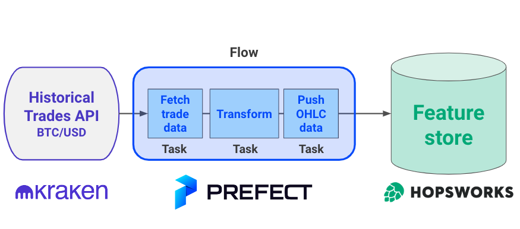

<div align="center">
    <h1>Feature backfilling</h1>
    <i>Backfill a feature group using <a href="https://www.prefect.io/">Prefect </a> and <a href="https://www.hopsworks.ai/">Hopsworks</a></i>
</div>

<br />

<div align="center">
    <sub>Let's connect 🤗</sub>
    <br />
    <a href="https://twitter.com/paulabartabajo_">Twitter</a> •
    <a href="https://www.linkedin.com/in/pau-labarta-bajo-4432074b/">LinkedIn</a> •
    <a href="https://paulabartabajo.substack.com/">Newsletter</a>
<br />
</div>

<p align="center">
  
</p>

#### Table of contents
1. [What is this repo about?](#what-is-this-repo-about)
2. [How to run this code](#how-to-run-this-code)
3. [Wannna build real-world ML products?](#wannna-build-real-world-ml-products)

## What is this repo about?
This repository shows how to backfill historical OHLC feature in a Feature Store (Hopsworks) using an orchestration tool (Prefect).


## How to run this code

- Create a Python virtual environment with the project dependencies with
    ```
    $ make init
    ```

- Connect to your Prefect Cloud
    ```
    $ prefect cloud login 
    ```

- Set environment variables necessary to talk to your Hopsworks feature store
    ```
    $ . ./set_hopsworks_credentials.sh
    ```

- Backfill OHLC data for a range of dates (e.g. from `2023-01-01` to `2023-01-31`)
    ```
    $ make from_day=2023-01-01 to_day=2023-01-31 backfill
    ```

## Wannna build real-world ML products?

Check the [Real-World ML Program](https://realworldmachinelearning.carrd.co/), a hands-on, 3-hour course where you will learn
how to design, build, [deploy](https://taxi-demand-predictor.streamlit.app/), and [monitor](https://taxi-demand-predictor-monitoring.streamlit.app/) complete ML products.


## TODOs
- [x] toy example prefect
- [x] monitor execution
- [x] task to connect to kraken trades api
- [x] full script to backfill given period
- [x] save data to hopsworks
- [ ] make diagram
- [x] beautiful readme
- [ ] newsletter - with 2 CTAs

